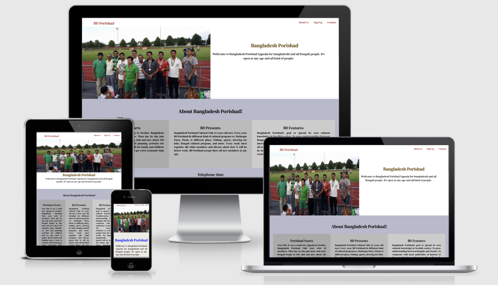

# BD Porishad
- The BD Porishad website is landing page for all kind of bengali people. looking for fun there kids.
- BD Porishad offers fun activities for kids to learn social education from young age.
- Users of the website able to find all the information they need to know about BD Porishad, about the meeting time, contact information and sign up form.

#### Features
- Navigation
    - Featured at the top of the page navigations shows the associations name.
    - The others navigation links are to the right About us, sign up and contact which links to differents section of the same page.
    - The navigation clearly tells the user the name of the associations and websites and make the different section of the information easy to find.

#### The Header
- The header shows the name of the association and using the color chosen golden.
- The header explain the associations place and age info..

#### The about us section
- The about us section shows details information about BD Porishad whats association offer and table based opening hour.
- In this section shows the user importent information about BD Porishad. why build up this association and uppcomming features program.

#### The sign up form
- The sign up section has form to collect users Full name.
- In this section has a form to collect users rmail address, so they can sign up to the BD Porishad.

#### The contact section
- The contact section encourage users to get in contact and provides a phone number email address and street address where they can be found.
- In this section user can fint social media link ex- facebook, twitter, instagram.
- This section is valuable to the user as its give them the ability to find and contact the Association.

